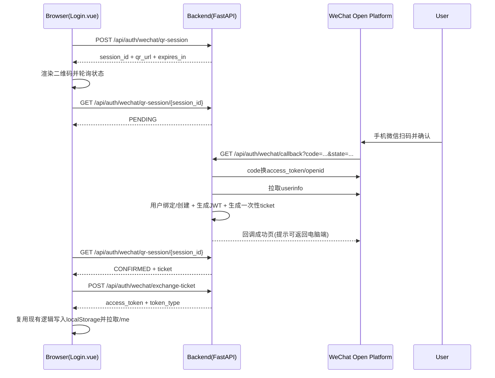

# OpenClaw Expenses 微信扫码登录设计方案

## 1. 背景与目标

当前系统登录方式仅支持账号密码：

- 前端：`/login` 页面提交用户名密码。
- 后端：`POST /api/auth/login` 签发 JWT。
- 鉴权：前端将 JWT 存入 `localStorage`，业务 API 通过 `Authorization: Bearer <token>` 访问。

目标是在不破坏现有密码登录和业务鉴权逻辑的前提下，新增微信扫码登录能力。

硬性约束：

- 微信扫码登录是对现有登录功能的补充，不是替代。
- 账号密码登录入口、接口和登录链路必须持续可用。

## 2. 现状代码基线

关键代码位置：

- 后端认证路由：`backend/app/auth/router.py`
- 后端认证服务：`backend/app/auth/service.py`
- JWT 工具：`backend/app/core/security.py`
- 前端登录页：`frontend/src/views/Login.vue`
- 前端认证状态：`frontend/src/stores/auth.ts`
- 前端 API 拦截器：`frontend/src/services/api.ts`

注意：仓库中存在多个后端入口（如 `backend/main_v2.py`、`backend/app/main.py`），本方案以模块化入口 `backend/app/main.py` 为主进行设计，并在上线前统一实际运行入口，避免“代码已实现但运行路径未生效”。

## 3. 设计原则

- 最小侵入：复用现有 JWT 机制，业务 API 无需改造。
- 并行登录：账号密码与微信扫码双入口并存，互不影响，可独立开关。
- 安全优先：不在 URL 直接透传 JWT；使用一次性票据换取 token。
- 可扩展：数据模型支持未来接入更多第三方登录（如支付宝、GitHub）。
- 幂等可靠：回调重复请求、网络重试场景可安全处理。

## 4. 总体方案

采用“微信开放平台网站应用扫码登录（QR Connect）”流程，前端轮询会话状态，后端完成回调处理并签发 JWT。

### 4.1 端到端时序



## 5. 后端设计

## 5.1 新增配置项

在 `backend/app/core/config.py` 增加：

- `WECHAT_OPEN_APP_ID`
- `WECHAT_OPEN_APP_SECRET`
- `WECHAT_OPEN_REDIRECT_URI`
- `WECHAT_OPEN_SCOPE`（默认 `snsapi_login`）
- `WECHAT_QR_SESSION_TTL_SECONDS`（建议 300）
- `WECHAT_LOGIN_TICKET_TTL_SECONDS`（建议 60）
- `WECHAT_HTTP_TIMEOUT_SECONDS`（建议 5）

并在 `backend/.env.example` 补充对应示例配置。

### 5.1.1 配置与代码隔离原则（本次需求强制）

- 禁止在业务代码中硬编码任何微信参数（`AppID`、`AppSecret`、回调地址、超时、TTL）。
- 微信登录配置单独管理，不与通用数据库/JWT配置混写在同一配置段落中。
- 配置读取与业务逻辑分离：建议新增独立配置对象（如 `WechatAuthSettings`），仅由微信登录模块依赖。
- 敏感配置仅通过环境变量或部署平台密钥管理注入，不进入前端构建产物、不写入日志。
- 启动阶段做配置校验（必填项缺失直接失败），避免运行时才暴露配置问题。

### 5.1.2 新增配置单独管理方案

建议新增以下配置管理约定：

- 新增示例文件：`backend/.env.wechat.example`（仅微信扫码登录相关配置）。
- 部署环境变量分组：`WECHAT_*` 前缀独立维护（CI/CD、K8s Secret、ECS 环境变量均可）。
- 文档清单单独维护：本节“新增配置清单”作为唯一基线，代码与部署脚本按该清单对齐。

新增配置清单（微信扫码登录）：

| 配置项 | 必填 | 默认值 | 敏感级别 | 说明 |
|---|---|---|---|---|
| `WECHAT_OPEN_ENABLED` | 否 | `false` | 低 | 功能开关，未开启时隐藏扫码登录入口或返回 404/501 |
| `WECHAT_OPEN_APP_ID` | 是（启用时） | 无 | 中 | 微信开放平台网站应用 AppID |
| `WECHAT_OPEN_APP_SECRET` | 是（启用时） | 无 | 高 | 微信开放平台 AppSecret，仅后端可见 |
| `WECHAT_OPEN_REDIRECT_URI` | 是（启用时） | 无 | 中 | 微信回调完整地址，如 `https://domain/api/auth/wechat/callback` |
| `WECHAT_OPEN_SCOPE` | 否 | `snsapi_login` | 低 | 微信网页扫码登录 scope |
| `WECHAT_QR_SESSION_TTL_SECONDS` | 否 | `300` | 低 | 扫码会话有效期 |
| `WECHAT_LOGIN_TICKET_TTL_SECONDS` | 否 | `60` | 低 | 一次性票据有效期 |
| `WECHAT_HTTP_TIMEOUT_SECONDS` | 否 | `5` | 低 | 后端调用微信接口超时 |
| `WECHAT_STATE_SIGN_SECRET` | 否 | 复用 `SECRET_KEY` 或独立配置 | 高 | `state` 签名/加密密钥，建议独立于 JWT 密钥 |
| `WECHAT_ALLOWED_REDIRECT_HOSTS` | 否 | 当前主域名 | 中 | 回调域白名单校验，防止错误跳转 |

实现约束：

- 仅微信模块读取 `WECHAT_*` 配置，其他业务模块不得直接依赖。
- 配置变更不应触发业务代码变更，确保“配置变更即行为调整”。
- 在 `/docs` 中保留该清单并随实现同步更新，避免“代码有配置、文档无配置”。

## 5.2 新增数据表

### 系统字段规范（所有新建业务表统一要求）

以下字段作为数据库表统一“系统字段”：

- `created_at`：创建时间。
- `updated_at`：更新时间。
- `created_by`：创建人（建议记录用户ID或系统账号，如 `SYSTEM`）。
- `updated_by`：更新人（建议记录用户ID或系统账号，如 `SYSTEM`）。
- `deleted_at`：软删除时间戳，`BIGINT`，默认值 `0` 表示未删除；当执行删除时更新为删除时的 Unix 时间戳（秒级或毫秒级，项目内需统一）。

说明：

- 微信扫码登录新增表应遵循上述系统字段规范。
- 业务查询需默认追加 `deleted_at = 0` 条件。

### A. 第三方身份绑定表 `auth_user_identity`

用途：将本地用户与第三方身份映射解耦，避免直接污染 `expenses_user`。

建议字段：

- `id` BIGINT PK AUTO_INCREMENT
- `user_id` VARCHAR(50) NOT NULL
- `provider` VARCHAR(32) NOT NULL（当前固定 `wechat`）
- `provider_user_id` VARCHAR(128) NOT NULL（优先 `unionid`，无则 `openid`）
- `wechat_openid` VARCHAR(128) NULL
- `wechat_unionid` VARCHAR(128) NULL
- `nickname` VARCHAR(128) NULL
- `avatar_url` VARCHAR(512) NULL
- `raw_profile_json` JSON NULL
- `created_at` DATETIME NOT NULL
- `updated_at` DATETIME NOT NULL
- `created_by` VARCHAR(50) NOT NULL
- `updated_by` VARCHAR(50) NOT NULL
- `deleted_at` BIGINT NOT NULL DEFAULT 0
- `last_login_at` DATETIME NULL

约束与索引：

- `UNIQUE(provider, provider_user_id)`
- `INDEX(user_id)`
- `INDEX(deleted_at)`

### B. 扫码登录会话表 `auth_login_session`

用途：承载扫码登录短期状态与一次性票据，避免 JWT 暴露在 URL。

建议字段：

- `session_id` CHAR(36) PK（UUID）
- `channel` VARCHAR(32) NOT NULL（`wechat_qr`）
- `state` CHAR(64) NOT NULL UNIQUE
- `status` VARCHAR(32) NOT NULL（`PENDING|CONFIRMED|EXPIRED|FAILED|CONSUMED`）
- `user_id` VARCHAR(50) NULL
- `ticket` CHAR(64) NULL UNIQUE
- `ticket_expires_at` DATETIME NULL
- `error_code` VARCHAR(64) NULL
- `error_message` VARCHAR(255) NULL
- `expires_at` DATETIME NOT NULL
- `created_at` DATETIME NOT NULL
- `updated_at` DATETIME NOT NULL
- `consumed_at` DATETIME NULL
- `created_by` VARCHAR(50) NOT NULL
- `updated_by` VARCHAR(50) NOT NULL
- `deleted_at` BIGINT NOT NULL DEFAULT 0

索引建议：

- `INDEX(status, expires_at)`
- `INDEX(ticket, ticket_expires_at)`
- `INDEX(deleted_at)`

## 5.3 新增 API 设计

### 1) 创建扫码会话

- 方法与路径：`POST /api/auth/wechat/qr-session`
- 请求体：空或扩展参数（如 `scene`）
- 响应：

```json
{
  "session_id": "uuid",
  "qr_url": "https://open.weixin.qq.com/connect/qrconnect?...",
  "expires_in": 300,
  "poll_interval_ms": 2000
}
```

处理逻辑：

- 生成 `session_id`、`state`、过期时间。
- 落库 `auth_login_session`（`status=PENDING`）。
- 拼接微信 `qrconnect` URL 返回前端。

### 2) 查询会话状态（轮询）

- 方法与路径：`GET /api/auth/wechat/qr-session/{session_id}`
- 响应：

```json
{
  "status": "PENDING",
  "expires_in": 178,
  "ticket": null,
  "error_code": null,
  "error_message": null
}
```

状态说明：

- `PENDING`：等待扫码确认。
- `CONFIRMED`：已回调完成，可兑换票据。
- `FAILED`：回调失败（用户拒绝、code 无效等）。
- `EXPIRED`：会话过期。
- `CONSUMED`：票据已兑换（终态）。

### 3) 兑换一次性票据

- 方法与路径：`POST /api/auth/wechat/exchange-ticket`
- 请求体：

```json
{
  "session_id": "uuid",
  "ticket": "one-time-ticket"
}
```

- 响应（沿用现有 Token 模型）：

```json
{
  "access_token": "jwt",
  "token_type": "bearer"
}
```

处理逻辑：

- 校验 `session_id/ticket/status/ticket_expires_at`。
- 原子更新会话状态为 `CONSUMED`，确保一次性。
- 基于 `user_id` 签发现有 JWT 并返回。

### 4) 微信回调接口

- 方法与路径：`GET /api/auth/wechat/callback?code=...&state=...`

处理逻辑：

- 校验 `state` 是否存在且未过期。
- 调微信接口换取 `access_token/openid/unionid`，再拉取用户信息。
- 根据 `provider=wechat + provider_user_id` 查找身份绑定：
  - 已存在：更新用户资料快照与 `last_login_at`。
  - 不存在：创建本地用户 + 创建绑定关系。
- 生成一次性 `ticket` 写入会话，状态置为 `CONFIRMED`。
- 返回简单 HTML（提示扫码成功，可回到电脑继续），不返回 JWT。

## 5.4 用户创建策略

为兼容现有 `expenses_user` 非空约束（`email`、`hashed_password`）：

- `username`：生成规则 `wx_<8位随机或哈希片段>`，确保唯一。
- `email`：`<username>@wx.local`（仅系统占位，不用于真实邮件）。
- `hashed_password`：写入随机密码哈希（不可登录用途）。
- `full_name`：优先使用微信昵称。

后续可选优化：当用户已使用密码登录时，支持在个人设置页“绑定微信”，实现同一用户多登录方式合并。

## 5.5 异常与幂等

- 回调重复：按 `state/session_id` 幂等处理，不重复创建用户。
- 微信接口失败：会话标记 `FAILED`，返回可重试提示。
- 会话过期：统一返回 `EXPIRED`，前端提示刷新二维码。
- 票据重放：首次成功后状态改为 `CONSUMED`，再次兑换返回 401/409。

## 6. 前端设计

## 6.1 登录页改造（`frontend/src/views/Login.vue`）

- 增加登录方式切换：`账号密码` / `微信扫码`。
- 默认仍展示账号密码登录，扫码登录作为并列可选项（不替代）。
- 微信扫码模式下：
  - 调用 `POST /api/auth/wechat/qr-session` 获取 `qr_url`。
  - 使用二维码组件渲染（建议 `qrcode` npm 包本地生成，不依赖第三方图床）。
  - 按 `poll_interval_ms` 轮询状态接口。
  - `CONFIRMED` 时调用兑换接口，拿到 JWT 后复用现有登录成功路径。

## 6.2 认证仓库改造（`frontend/src/stores/auth.ts`）

- 新增 `loginWithToken(token: string)`：
  - 写入 `localStorage`；
  - 更新 `token` 状态；
  - 调用 `fetchUser()`；
  - 保持与密码登录同一收敛流程。

## 6.3 UI/交互状态

- 初始：显示二维码、倒计时。
- 轮询中：显示“请使用微信扫码确认”。
- 过期：显示“二维码已过期，点击刷新”。
- 失败：展示明确错误文案并可重试。

## 7. 安全设计

- `state` 必须强随机且与会话强绑定，防 CSRF。
- `ticket` 一次性、短 TTL（建议 60 秒）。
- 不在 URL 透传 JWT。
- 微信 `app_secret` 仅后端使用，禁止暴露前端。
- 接口限流建议：
  - `qr-session` 创建接口按 IP/设备限频。
  - `callback` 接口按 `state` 限幂等。
- 审计日志：
  - 记录会话创建、回调成功/失败、票据兑换、异常码。

## 8. 实施计划

### Phase 1（当前）

- 完成设计评审与文档确认。

### Phase 2（开发）

- 后端：表结构迁移 + 新增微信服务与路由 + 配置项补齐。
- 前端：登录页扫码模式 + 轮询与兑换逻辑。
- 联调：本地/测试环境接入微信开放平台应用配置。

### Phase 3（上线）

- 灰度开启扫码登录能力（密码登录持续保留为默认入口之一）。
- 监控回调成功率、登录成功率、失败原因分布。
- 稳定后将扫码登录置为主入口之一。

## 9. 验收标准

- 密码登录不回归，现有业务接口鉴权无改动。
- 登录页同时支持“账号密码登录 + 微信扫码登录”两个入口。
- 微信扫码成功后可进入系统并正常访问受保护页面。
- 票据不可重放，过期会话不可兑换。
- 用户首次扫码自动建档，再次扫码命中同一账号。

## 10. 微信接入信息清单与申请指南

以下为接入微信扫码登录（网站应用）建议准备清单，具体字段以微信开放平台页面实时要求为准。

### 10.1 信息清单（Checklist）

### A. 开放平台账号与主体材料

- 开放平台开发者账号（企业主体）。
- 主体资质材料（营业执照、法人/管理员身份信息、联系方式等）。
- 认证状态（是否已完成开放平台认证）。

### B. 网站应用信息

- 应用名称（中文名、英文名如需）。
- 应用简介与应用图标（按平台尺寸/格式要求）。
- 网站首页 URL（线上可访问）。
- 业务场景说明（用于审核说明“为何需要微信登录”）。

### C. 域名与安全信息

- 已备案域名（中国大陆场景通常要求备案）。
- HTTPS 证书可用（建议全站 HTTPS）。
- 微信登录授权回调域（仅域名，不含具体 path，按平台要求配置）。
- 实际回调地址（例如 `https://your-domain.com/api/auth/wechat/callback`）。

### D. 技术配置项（上线必填）

- `WECHAT_OPEN_APP_ID`
- `WECHAT_OPEN_APP_SECRET`
- `WECHAT_OPEN_REDIRECT_URI`
- 允许发起登录的前端域名（与回调域策略一致）。
- 登录会话 TTL、票据 TTL、安全日志策略。

### 10.2 申请指南（建议流程）

1. 注册并登录微信开放平台开发者账号。
2. 完成开发者/主体认证，确保账号具备网站应用能力。
3. 在管理后台创建“网站应用”，填写应用基本信息与网站信息。
4. 配置“授权回调域”，提交审核。
5. 审核通过后，获取 `AppID` 与 `AppSecret`。
6. 在服务端环境变量中配置微信参数，并部署回调接口。
7. 使用测试账号走完整链路联调：生成二维码 -> 扫码授权 -> 回调 -> 兑换 JWT。
8. 完成安全检查与灰度发布（保留密码登录入口不变）。

### 10.3 申请与审核注意事项

- 回调域、站点域名、实际访问域名需一致，避免回调失败。
- `AppSecret` 仅后端保存，严禁前端代码/日志泄露。
- 申请说明建议明确“仅用于站点账号登录鉴权，不做超范围数据采集”。
- 若后续要打通公众号/小程序同一用户体系，需提前规划 `unionid` 统一策略。

## 11. 风险与待确认项

- 运行入口未统一风险：若线上仍运行 `main_v2.py`，需同步接入或先切换到 `backend/app/main.py`。
- 微信开放平台资质与回调域名需提前备案并配置。
- 若后续需要“微信绑定已有账号”而非自动建新账号，需要补充账号合并策略与冲突处理规则。
